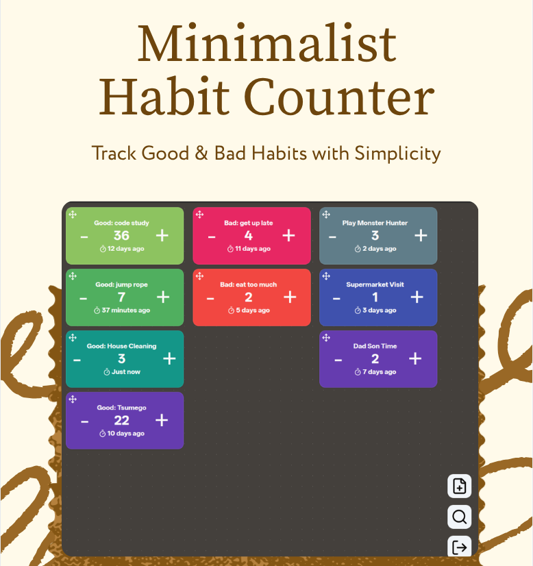
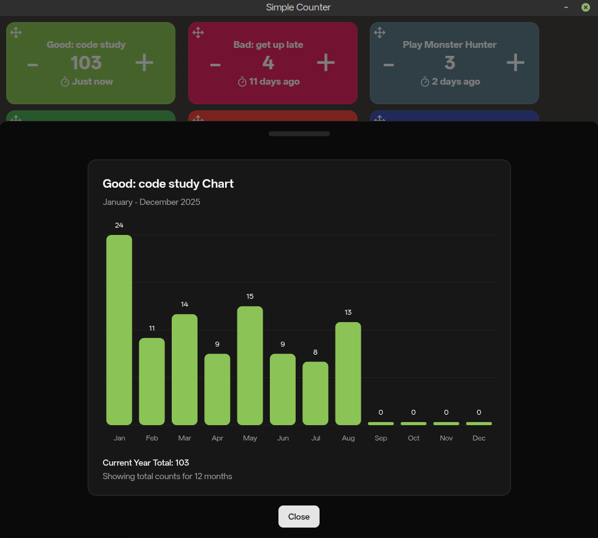

# 

I liked the app [bettercounter](https://github.com/albertvaka/bettercounter) a lot, i like it simple, so i made this similar app for desktop use.

## 💡Features

- Track your habits, good or bad. Know when's the last time you did it.
- Left click to view habits in chart.
- Right click to edit or delete.
- Arrange and search habits in responsive grid.
- Everthing stored locally with minimal UI, and will stay this way.

## 📝License

This project is licensed under the MIT license
